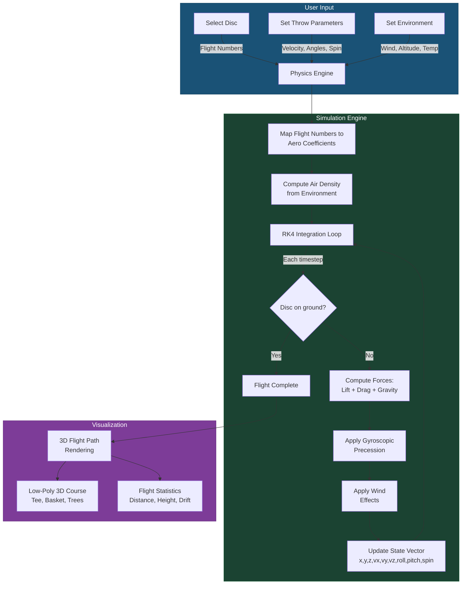

# DGDSIM — Disc Golf Disc Flight Simulator

A web-based disc golf disc flight simulator that uses real aerodynamic physics to visualize how discs fly. Select a real disc from the PDGA-certified database, configure throw parameters and environmental conditions, and watch the flight unfold in a stylized low-poly 3D course.

**This is a simulation tool, not a game.** The goal is to help disc golfers understand how discs behave under different conditions and to provide manufacturers/retailers with embeddable flight visualizations.

## How It Works

The simulator connects three systems: a disc database of real discs with their flight numbers, a physics engine that models aerodynamic flight, and a 3D renderer that visualizes the results.



### Simulation Pipeline

1. **Disc Selection**: User picks a disc from the database. Each disc has four flight numbers (Speed, Glide, Turn, Fade) that describe its aerodynamic character.

2. **Coefficient Mapping**: Flight numbers are translated into aerodynamic coefficients using an empirical model based on disc flight research. Speed maps to base drag, Glide to lift coefficient, Turn to high-speed stability (pitching moment offset), and Fade to low-speed stability (pitching moment slope).

3. **Environment Calculation**: Air density is computed from altitude, temperature, and humidity using the barometric formula and Magnus equation for vapor pressure. Wind is decomposed into headwind and crosswind components.

4. **RK4 Integration**: The core simulation runs a 4th-order Runge-Kutta integrator at 5ms timesteps over an 11-element state vector: `[x, y, z, vx, vy, vz, roll, pitch, spin, rollRate, pitchRate]`. At each step, lift, drag, and gravity forces are computed, gyroscopic precession is applied (the pitching moment couples with spin to create roll/pitch rate changes), and spin decays exponentially.

5. **Visualization**: The resulting trajectory (array of 3D points) is rendered as a colored line/tube in a Three.js scene with a low-poly stylized disc golf course.

## Flight Numbers Explained

Disc golf discs are rated on four numbers printed on the disc:

| Number | Range | What it describes |
|--------|-------|-------------------|
| **Speed** | 1–14 | How fast the disc needs to be thrown to fly as intended. Higher speed discs have sharper edges and need more arm speed. |
| **Glide** | 1–7 | How well the disc stays aloft. Higher glide discs float more and carry farther at a given speed. |
| **Turn** | -5 to +1 | High-speed stability. Negative values mean the disc turns right (for RHBH) during the fast portion of flight. More negative = more understable. |
| **Fade** | 0–5 | Low-speed stability. How hard the disc hooks left (for RHBH) at the end of flight as spin decays. Higher fade = harder finish. |

The simulator maps these to aerodynamic coefficients:

- **Speed → Drag (CD₀)**: Higher speed discs have slightly more parasitic drag but are designed for higher velocities
- **Glide → Lift (CL₀)**: More glide = higher zero-alpha lift coefficient = more float
- **Turn → Pitching Moment Offset (CM₀)**: Understable discs have negative CM₀, causing high-speed turn via gyroscopic precession
- **Fade → Pitching Moment Slope (CMα)**: More fade = more negative CMα = stronger restoring moment at low speed

## Physics Model

The aerodynamic model is based on published disc/Frisbee flight research. A spinning disc in flight experiences:

- **Lift**: Perpendicular to the velocity vector, in the plane of velocity and disc normal. Generated by the disc's airfoil shape and angle of attack.
- **Drag**: Opposing the velocity vector. Combination of parasitic (form) drag and induced drag from lift.
- **Pitching Moment**: Torque about the disc's lateral axis. For a spinning disc, this moment causes gyroscopic precession (roll change) rather than direct pitch change — this is why discs curve.
- **Gravity**: 9.81 m/s² downward, always.

The interplay between spin, precession, and aerodynamic moments is what creates the characteristic S-curve flight of understable discs and the reliable fade of overstable discs.

### Key Physics References

1. **Hummel, S.A. (2003)**. "Frisbee Flight Simulation and Throw Biomechanics." M.S. Thesis, University of California, Davis. — The foundational work on computational disc flight modeling with wind tunnel data.

2. **Crowther, W.J. & Potts, J.R. (2007)**. "Simulation of a spin-stabilised sports disc." *Sports Engineering*, 10(1), 3-12. — Refined the flight model with better precession modeling and validated against real flight data.

3. **Potts, J.R. & Crowther, W.J. (2002)**. "Frisbee aerodynamics." AIAA Paper 2002-3150. — Wind tunnel measurements of disc aerodynamic coefficients across angle-of-attack range.

4. **Lorenz, R.D. (2005)**. "Flight and attitude dynamics of an instrumented Frisbee." *Measurement Science and Technology*, 16(3), 738. — Real-world instrumented flight data confirming the spin-precession coupling model.

5. **Morrison, V.R. (2005)**. "The Physics of Frisbees." *Electronic Journal of Classical Mechanics and Relativity*. — Accessible overview of disc aerodynamics for the general physicist.

### Atmospheric Model

Air density is computed using the International Standard Atmosphere model with humidity correction:

- Pressure at altitude via barometric formula: `P = P₀(1 - Lh/T₀)^(gM/RL)`
- Saturation vapor pressure via Magnus formula: `Psat = 611.2 × exp(17.67T/(T+243.5))`
- Moist air density: `ρ = Pd/(Rd×T) + Pv/(Rv×T)`

## Tech Stack

- **React 19** + **TypeScript** — UI framework
- **Three.js** via **React Three Fiber** + **Drei** — 3D rendering
- **Zustand** — State management
- **Vite** — Build tooling
- **Tailwind CSS v4** — Styling
- **Vitest** — Testing
- **Cloudflare Pages** — Hosting

## Development

```bash
# Install dependencies
npm install

# Start dev server
npm run dev

# Run tests
npm test

# Build for production
npm run build
```

## Project Structure

```
src/
├── physics/       # Pure simulation engine (no React deps, fully testable)
├── data/          # Disc database and types
├── scene/         # Three.js 3D components (R3F)
├── ui/            # React UI panels and controls
├── store/         # Zustand state stores
└── utils/         # Constants, math helpers
```

## License

Copyright (c) 2026 Jonas Pettersson. All rights reserved.
This is proprietary software. See [LICENSE](LICENSE) for details.
